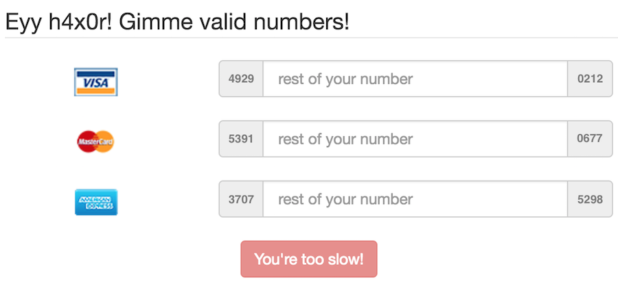
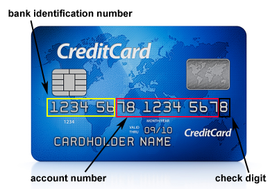

#ECOPARTY CTF 2016: Carder
Solved by me
##Challenge

###Carder
(web, 150 points, solved by 119)
```
The fastest carder from the far west.

http://86dc35f7013f13cdb5a4e845a3d74937f2700c7b.ctf.site:20000
```

##Solution

By clicking the link we are redirected to a page that looks like this:



There are three inputs with partial card numbers and we are supposed to complete what is missing.
Also, there is a 15 seconds countdown button, so you must solve it fast.

Credit card numbers are generated following some rules.


> source: http://www.mobilefish.com/services/credit_card_number_generator/credit_card_number_generator.php

And the check digit is validated using [Luhn Algorithm](https://en.wikipedia.org/wiki/Luhn_algorithm) a.k.a. mod 10.
Which means is not that hard to generate valid credit card numbers.

*PS: valid doesn't mean active, so you can't buy anything with it.*

I worked based on the following premises:
- Visa card has 13 digits (Visa has 16 digits cards too but here it was a 13-bit)
- Mastercard has 16 digits
- Amex has 15 digits

With all in mind, I wrote a script that gets the partials, generate random numbers to complete the sequence and checks if its a valid credit card number using Luhn algorithm.
After that, it fills the inputs accordingly, so I just need to click on send button to see the result *(I could have made the script click it for me too but I prefered the pleasure of doing it manually :P)*.

On clicking the button I got the flag: `EKO{8392692f28204c12bd7797d7d95cb967}`

The script code is here: [creditcard.js](creditcard.js)

The code is a little messy - it was made in a hurry - some things to improve:
- I used `innerText` but it doesn't work on Firefox, the best option should be `textContent`.
- They have jquery on the page, I could have used when getting elements, the code would look easier to read.
